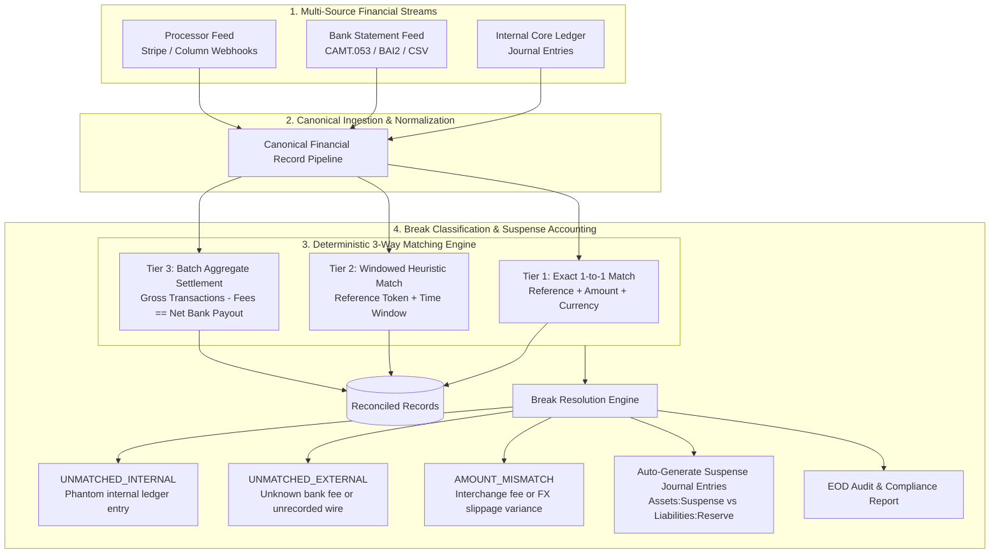

# ReconMesh 🔍⚖️

[](https://golang.org)
[](https://openapis.org)
[](https://opensource.org/licenses/MIT)

> **High-performance, spec-driven End-of-Day (EOD) 3-Way Financial Reconciliation and Break Resolution Engine built in Go.**
> Engineered to prove data integrity between internal core ledgers, regulated banking settlement statements (CAMT.053, BAI2, CSV), and payment gateway processor feeds.

---

## 🏛️ System Architecture



---

## 🎯 Key Architectural Hallmarks

1. **Spec-Driven Development (SDD):**
   - Single source of truth OpenAPI 3.1 contract (`api/openapi/v1/recon.yaml`) defining reconciliation job creation, break queries, manual resolutions, and audit reporting.
2. **Deterministic 3-Way Matching:**
   - Multi-tier matching pipeline: Exact match (`end_to_end_id`, currency, minor-unit amount) → Windowed heuristic match → Batch aggregate match (reconciling processor gross minus fees against net bank deposits).
3. **Automated Break Resolution & Suspense Accounting:**
   - Every unmatched dollar is automatically classified:
     - `UNMATCHED_INTERNAL` (Money debited internally but not cleared at the bank).
     - `UNMATCHED_EXTERNAL` (Orphan charge or incoming wire at bank not present in ledger).
     - `AMOUNT_MISMATCH` (Discrepancy in settlement amount).
   - Generates balancing suspense accounting entries to ensure overall balance sheets remain balanced during investigation.
4. **Sub-50ms Throughput at Scale:**
   - Designed for high-frequency banking infrastructure: reconciles **10,000 transactions in under 50 milliseconds** with minimal memory allocations.

---

## 🚀 Getting Started

### Prerequisites
- Go 1.22+
- Make

### Quickstart

```bash
# Clone the repository
git clone https://github.com/akmalkhaniub/recon-mesh.git
cd recon-mesh

# Run tests
make test

# Run high-volume 10,000-transaction benchmark
make bench

# Build and run the server
make run
```

---

## 📜 API Contract

Inspect `api/openapi/v1/recon.yaml`:
- `POST /v1/reconciliation/jobs` (Trigger an automated reconciliation run)
- `GET /v1/reconciliation/jobs/{id}` (Check match rate, matched total, broken value)
- `GET /v1/reconciliation/jobs/{id}/breaks` (List categorized breaks)
- `POST /v1/reconciliation/breaks/{id}/resolve` (Resolve a break with audit trail)
- `GET /v1/reconciliation/jobs/{id}/report` (Download EOD audit summary)
